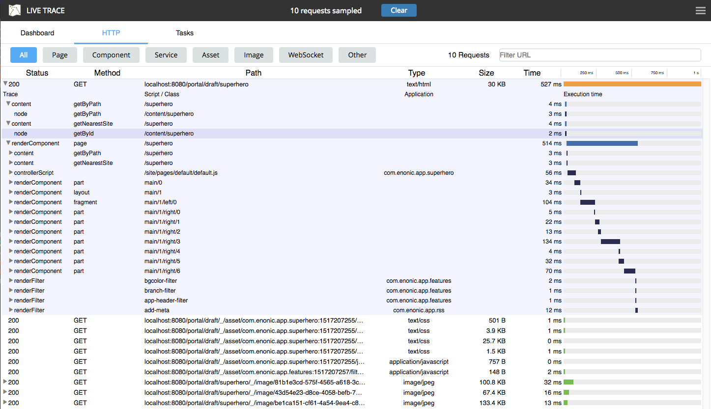

= Live Trace

image::https://img.shields.io/badge/xp-6.13+-blue.svg[role="right"]

Live Trace allows *capturing traffic* that is sent to XP and analyzing its performance.

This tool helps *finding bottlenecks* and what is causing them,
so that the developer can *improve the performance of XP applications*.

== Dashboard

The dashboard shows a summary of the current status for the running server.
This includes some details of the current node, the status of the cluster, and also some graphs with system metrics.

=== Node

Details from the current node:

- `Name`: name of the XP node.
- `Is Master`: whether this node is the master in the cluster or not.
- `XP Version`
- `JVM`: producer of the JVM.
- `JVM version`
- `Uptime`: How long has the server been up and running.

=== Cluster

Details from the current cluster:

- `Name`: name of the cluster.
- `State`: current state of the cluster.
- `Nodes`: number of nodes in the cluster.

=== HTTP Requests

This graph shows the number of HTTP requests per second, including the history for the last minutes.

=== JVM Memory

This graph shows the memory used by the Java Virtual Machine (in megabytes), including the history for the last minutes.

=== Threads

This graph shows the total number of threads used by the JVM, and also the number of threads that handle HTTP requests.

== HTTP

In the HTTP tab you can trace the HTTP traffic coming to XP. By tracing you can capture the execution of HTTP requests, analyze its flow, and find which parts are taking most time.
This in turn allows you to find bottlenecks and improve the performance of your application.

=== How to trace

. To start a trace simply select the HTTP tab and click on `"Start Sampling Data"`.
. The system will start the tracing and any requests received will appear listed in the request table.
. When you have received enough data, click `"Stop Sampling Data"`.

=== Request table

The request table contains the list of requests captured during tracing.
The table has the following columns:

- `Status`: HTTP status response code.
- `Method`: HTTP method of the request (GET, POST, etc)
- `Path`: URL path of the request.
- `Type`: Content type of the response.
- `Size`: Size of the response in bytes.
- `Time`: Duration of the request handling on the server.

TIP: Click on the `Time` column header to toggle between duration and start time of the request.

Requests that imply execution of custom code on the server (everything besides _"asset"_ requests) can be expanded to show the sub-steps done as part of the request.
These sub-steps will show different information depending on the case. Some examples are Page rendering, Part rendering, Content queries, Node queries, HTTP requests (using lib-http-client), etc.

To expand or collapse the request details click on the row. Click and press the Shift key to expand all its contents at once.

=== Request filters

The list of requests from tracing can be filtered depending on its type.

To filter by type of resource click on one of the buttons above the table:

- `All`: Shows all the requests.
- `Page`: Shows only requests handled by a Page controller.
- `Component`: Shows only requests handled by a Component controller, i.e. Part or Layout.
- `Service`: Shows only requests handled by a Service controller in the application.
- `Asset`: Shows only requests for asset resources.
- `Image`: Shows only requests for images.
- `WebSocket`: Shows only requests using the WebSocket protocol.
- `Other`: Shows requests not included in the previous types, for example Admin Widget requests.

In addition, it is possible to filter the list of requests by typing part of a URL in the `Filter URL` field.

== Tasks

The Tasks tab shows the list of asynchronous jobs (aka Tasks) running in XP.

The task table has the following columns:

- `Name`: The name of the task.
- `App`: The key of the application from where the task was submitted.
- `User`: The user that submitted the task.
- `Description`: A description for the task, if specified.
- `Time`: The total execution time for the task.
- `Progress`: A progress indicator depending on info reported by the task.
